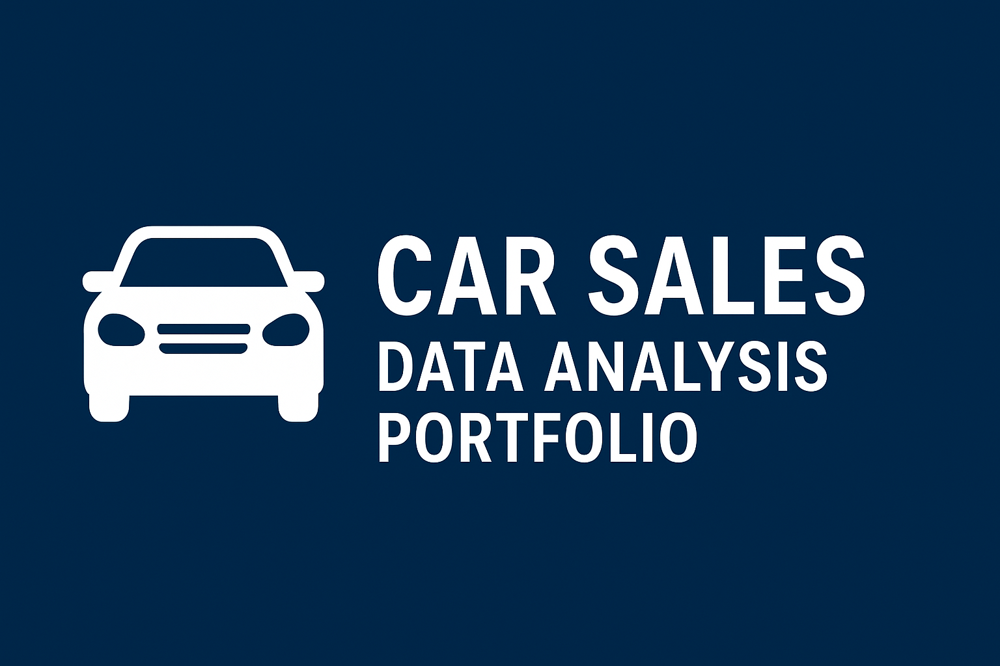

<p align="center">
  
</p>


# 🚗 Car Sales Data - Exploratory Data Analysis (EDA)

## 📌 Project Overview
This project performs an **Exploratory Data Analysis (EDA)** on a Car Sales dataset sourced from Kaggle.  
The goal is to uncover patterns, trends, and insights from the dataset using data cleaning, visualization, and statistical exploration techniques.

---
## 📊 Dataset
- **Source**: [Kaggle - Car Sales Dataset](https://www.kaggle.com/)  
- **Content**: Includes information on car prices, sales figures, specifications, and other attributes.  
- **Use Case**: Helps understand factors influencing car sales and price variations.

---
## 🔍 EDA Workflow
The analysis is organized into the following steps:
1. **Understand the Dataset Structure**
2. **Data Cleaning & Preprocessing**
3. **Univariate Analysis**
4. **Bivariate & Multivariate Analysis**
5. **Key Insights & Observations**

---
## 📈 Visualizations & Insights
The notebook includes multiple plots and charts to analyze:
- Distribution of car prices & sales  
- Correlation between features  
- Trends in sales across categories  
- Factors influencing car pricing  

---
## ⚙️ Tech Stack
- Python 🐍  
- Pandas, NumPy  
- Matplotlib, Seaborn  
- Jupyter Notebook  

---
## 🚀 How to Run the Project
1. Clone the repository:  
   ```bash
   git clone https://github.com/Mjabeen164/Car-Sales-EDA.git
   cd Car-Sales-EDA
Install the dependencies:

pip install -r requirements.txt
Open Jupyter Notebook and run:
jupyter notebook EDA-Car_sales.ipynb

---
## 📂 Repository Structure

```
├── EDA-Car_sales.ipynb   # Main analysis notebook
├── README.md             # Project documentation
├── requirements.txt      # Dependencies
└── data/                 # Dataset (if applicable)
📝 License
This project is for educational purposes only.
Dataset © Kaggle contributors.

```

---

## 🔗 Link to Full Blog

Read the full write‐up, plots, and detailed insights on my blog:  
[EDA with Car sales Data](https://www.blogger.com/blog/post/edit/6450674141124843179/8386987149357262473)


---
👨‍💻 **Author:** Munawer Jabeen  
📬 Reach me on [LinkedIn](https://www.linkedin.com/in/munawer-jabeen-900811380/) | [GitHub](https://github.com/Mjabeen164)  